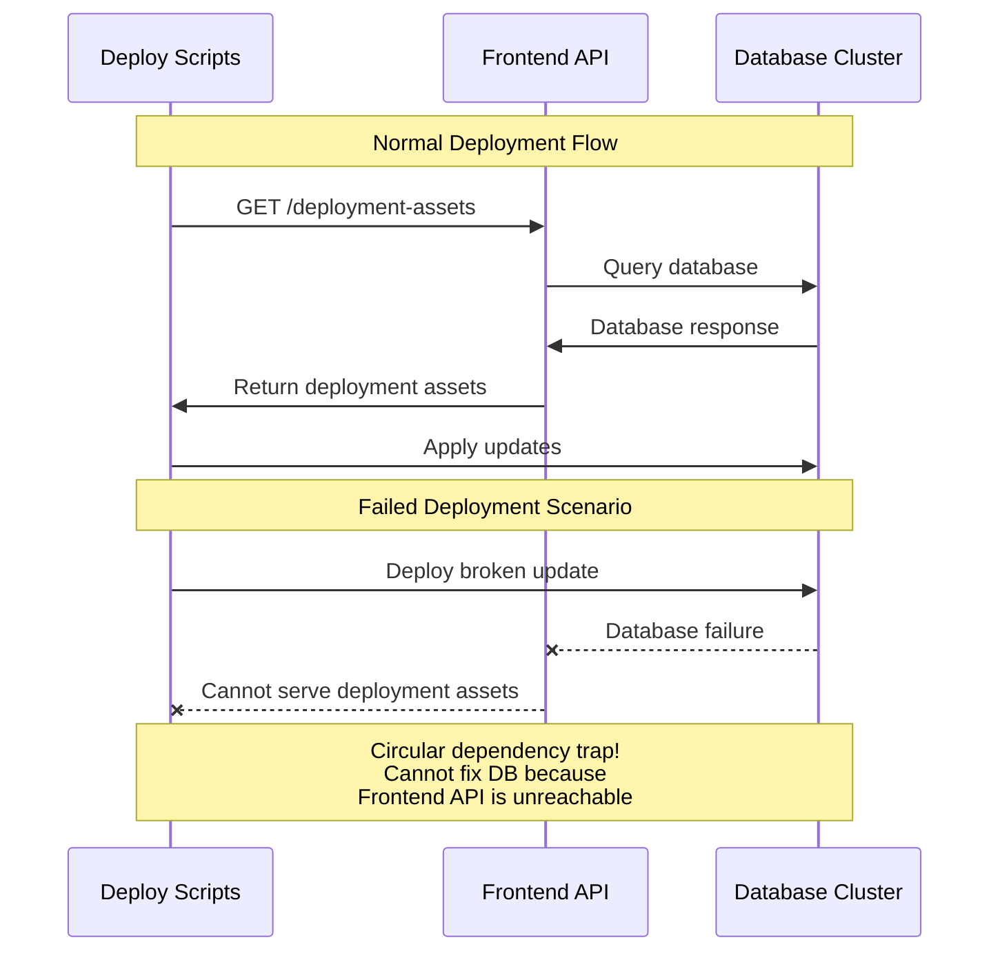

I work at GitHub on the internal deployment tooling. 

The site is a distributed system, made up of services which together form the functionality of the site and our deployment tooling ships all of these. 

This blog is going to look at the issues of circular dependencies and a recent experiment that I've run to try and prevent them. 

## What is a deploy-time circular dependency in a distributed system?

Let's take a simplified but real example.

You have 2 components, a frontend and a database cluster. 

The frontend is hosting source code, docker images and build systems. 

The database cluster is run on machines and during deployment scripts are executed which pull new configuration, code and containers which together make the database cluster function. 

Have you spotted it yet? If you deploy a broken version to the database cluster it results in the frontend being down. To fix the database cluster you need to deploy a change but the deploy script for the cluster needs to pull assets from the frontend. 

In the cause of incidents it is responsible for rolling back a bad change too.

