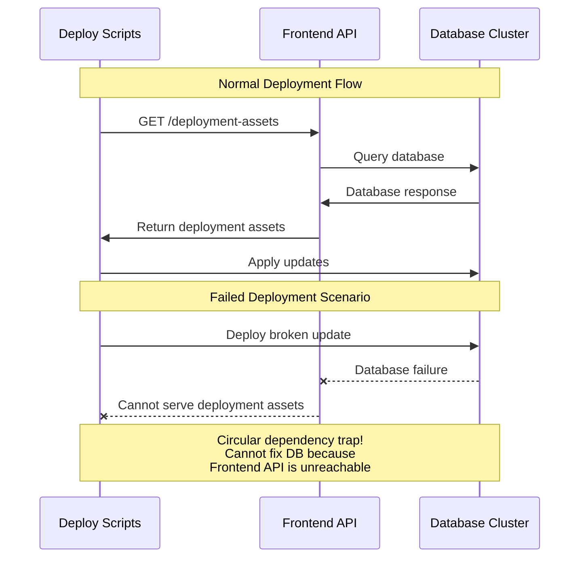

I work at GitHub on the internal deployment tooling. 

The site is a distributed system, made up of services which together form the functionality of the site and our deployment tooling ships all of these. 

This blog is going to look at the issues of circular dependencies and a recent experiment that I've run to try and prevent them. 

## What is a deploy-time circular dependency in a distributed system?

Let's take a simplified but real example.

You have 2 components:
1. A frontend: It hosts code and provides an API to download it
2. A database cluster: Hosts data for the frontend 

Updates to the database are deployed to machines by running scripts on the machines. These pull new configuration, code and containers. Internally you use your own product, so these are served by the frontend. 

Now we have a simple circular dependency.

If you deploy broken code to the database cluster it takes the frontend down.

To fix it you need to rollback the database clusters code to it's previous version. 

You can't though, the deploy script for the cluster needs to pull assets which is does from the frontend.

## Well of course, no one would do that! Right?

No people wouldn't, such a simple circular dependency would be easy to spot
and prevented.

But let's scale this up, say the frontend is made of 100's of systems making a complex distributed system. Says these 100s of systems are owned by 100s of teams.

Well now things get interesting. 

No one team holds this whole chain of dependencies in their area of responsibility, it's complex, long and context can get lost between different parts of that organization. 

## Specifically, lets look at deployment

A team owns the DB service and another team owns the deployment tooling. 

The team writing the DB service have a script which runs pre-deployment
to check if the node is ok to drain. 

The team writing the deploy tooling have tests that validate they can dispatch scripts to all the nodes and they complete. 

The deploy tooling team also check they can still dispatch scripts while key bits of the system are down. 

Spot the gap, who tests that the specific script for the DB service can run while key bits of the system are down. No one. 

It's easy to do, say the DB service script uses a CLI tool to check and drain the connections. 

That tool has a simple check when it's run, it looks to see if there is a new version of it. 

Well, it turns out that the site it uses to make that check is the front end served by the DB service. 

When it can't make that check if crashes. 

Now no one has written "make the db service call the frontend during deployment" they've only written "use CLI x to check and drain connections" and completely unknown to them this has introduced a circular dependency. 

## Shift Left: Fail early on deploy time circular dependency

How do we fix this? We can't in every scenario. 

There are tools thought, chaos engineering and game day simulations. 

There are also technical options that help. 

I recently worked on making it much more difficult to introduce a circular dependency at depoy time. 

To do this we need to block certain requests on the box. Stop it calling this frontend by mistake. 

We can't block all calls for all processes though as that would break operation of the site during the deployment. 

We also can't block by IP as these quickly become out dated. 

Requirements
1. Block calls based on DNS
2. Block only for certain processes on the box

### CGroups and eBPF

