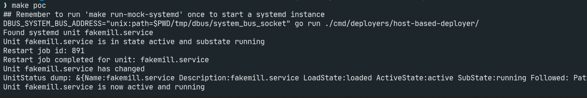

I'm current working on code which lives in an agent, written in [`golang`](https://go.dev/), 
which is running on a fleet of machines.

The agent needs to, when a new version of an application is deployed, 
restart the `systemd unit` and make sure it comes up healthy and running.

Here is the output of what we're going to build:



## ☠️ Dead-end: Try calling `systemctl` and parse the `stdout`

This is the most obvious route. You `exec.Command` and look at the output. 

While it's obvious it has some downsides, you're going to end up doing `strings.Contains`. 

Then when you are monitoring you'll end up wrapping this in a `for {}` loop.

This didn't feel like a great option. Can we do better?

## 🚀 `go-systemd` Library: Talking to `systemd` via `dbus`

What's `dbus`? 

> D-Bus (short for "Desktop Bus"[4]) is a message-oriented middleware mechanism that allows communication between multiple processes running concurrently on the same machine.

Behind the scenes, when you call `systemctl` the CLI tool is sending and receiving `dbus` messages. 

There is [lovely doc](https://www.freedesktop.org/wiki/Software/systemd/dbus/) showing all the methods related to `systemd` you can call via `dbus`

Even better there is a go library [coreos/go-systemd](https://github.com/coreos/go-systemd) which gives a nice way to interface with that `dbus` interface.

The result it some nice, strongly typed, methods that let you talk to `systemd`

Let's connect and list the services on the box 👇

```golang
    // What service are we looking at?
	targetSystemdUnit := "fakemill.service"

	ctx := context.Background()
	// Connect to systemd
	// Specifically this will look DBUS_SYSTEM_BUS_ADDRESS environment variable
	// For example: `unix:path=/run/dbus/system_bus_socket`
	systemdConnection, err := dbus.NewSystemConnectionContext(ctx)
	if err != nil {
		fmt.Printf("Failed to connect to systemd: %v\n", err)
		panic(err)
	}
	defer systemdConnection.Close()

	listOfUnits, err := systemdConnection.ListUnitsContext(ctx)
	if err != nil {
		fmt.Printf("Failed to list units: %v\n", err)
		return exitCodeFailedToListUnits
	}

	found := false
	targetUnit := dbus.UnitStatus{}
	for _, unit := range listOfUnits {
		if unit.Name == targetSystemdUnit {
			fmt.Printf("Found systemd unit %s\n", targetSystemdUnit)
			found = true
			targetUnit = unit
			break
		}
	}
	if !found {
		fmt.Printf("Expected systemd unit %s not found\n", targetSystemdUnit)
		return 1
	}
```

Now we know the service exists, let's restart it, notice we can use `channels` to subscribe to results here, 
we'll do some more of this later too. 

```golang
    completedRestartCh := make(chan string)
	jobID, err := systemdConnection.RestartUnitContext(
		ctx,
		targetSystemdUnit,
		restartMode,
		completedRestartCh,
	)

	if err != nil {
		fmt.Printf("Failed to restart unit: %v\n", err)
		panic(err)
	}
	fmt.Printf("Restart job id: %d\n", jobID)

	// Wait for the restart to complete
	select {
	case <-completedRestartCh:
		fmt.Printf("Restart job completed for unit: %s\n", targetSystemdUnit)
	case <-time.After(30 * time.Second):
		fmt.Printf("Timed out waiting for restart job to complete for unit: %s\n", targetSystemdUnit)
	}
```

Because we have channels we can make use of the `select` statement, waiting on the restart command to 
compete or 30 secs to pass. If we can't successfully restart in that time we can give up and timeout. 

So now the service has been restarted, how do we tell if it's healthy and running?

Well we can use a similar approach, `coreos/go-systemd` lets you subscribe to changes for services. 

You pass 2 functions, one to filter the services that you're interested in and another to check if the 
change is one you care about or not. 

Here is an example

```golang
    // Wait for the service to reach a running state

    // Ignore any services that we don't care about by filtering them out
	filterUnits := func(unit string) bool {
		return unit != targetSystemdUnit
	}


	// Configure which changes we care about
	isRelevantChangeFunc := func(before *dbus.UnitStatus, after *dbus.UnitStatus) bool {
		if before.ActiveState != after.ActiveState {
			fmt.Printf("Active state changed from %s to %s\n", before.ActiveState, after.ActiveState)
			return true
		}
		if before.SubState != after.SubState {
			fmt.Printf("Sub state changed from %s to %s\n", before.SubState, after.SubState)
			return true
		}
		return false
	}

	// Subscribe to the changes
	channelBuffer := 10

	changeCh, errorCh := systemdConnection.SubscribeUnitsCustom(time.Millisecond*10, channelBuffer, isRelevantChangeFunc, filterUnits)

	// Wait for the service to be active and running or give up
	for {
		select {
		case changedUnits := <-changeCh:
			unitStatus := changedUnits[targetSystemdUnit]
			fmt.Printf("Unit %s has changed\n", targetSystemdUnit)
			fmt.Printf("UnitStatus dump: %+v \n", unitStatus)
			if unitStatus.ActiveState == desiredActiveState && unitStatus.SubState == desiredSubState {
				fmt.Printf("Unit %s is now active and running\n", targetSystemdUnit)
				return exitCodeSuccess
			}
		case <-errorCh:
			fmt.Printf("Error while waiting for unit %s to change\n", targetSystemdUnit)
			return exitCodeErrorWhileWaiting
		case <-time.After(30 * time.Second):
			fmt.Printf("Timed out waiting for restart job to complete for unit: %s\n", targetSystemdUnit)
			return exitCodeTimeoutWaitingForRestart
		}
	}
```

That's it, here is [the full code](./main_example.go) from above all together.

## Bonus: Testing against dummy `systemd`

So we don't break with your real `systemd` on your machine, you can setup a docker container running `systemd` and mount the unix socket to the host.

To make that easy I used [mock-systemd-bus](https://github.com/balena-os/mock-systemd-bus). 


```yaml
services:
 mock-systemd:
    image: ghcr.io/balena-os/mock-systemd-bus@sha256:79b92200fb6481edfea9776a75d6bf3fd8583b79b7e83868f49ba7b295f397ce
    # Necessary to run systemd in a container
    privileged: true
    volumes:
      - ./tmp/dbus:/shared/dbus
    environment:
      # Set this variable with the location of your shared bus socket
      # NOTE: do not use /run/dbus as this path is overwritten by systemd
      # Pinned for reproducibility https://github.com/balena-os/mock-systemd-bus/pkgs/container/mock-systemd-bus
      DBUS_SYSTEM_BUS_ADDRESS: unix:path=/shared/dbus/system_bus_socket
      # Optionally set-up any mock units you need. Service files for these
      # Will be created on service start
      MOCK_SYSTEMD_UNITS: fakemill.service
```

With that service started you can set `DBUS_SYSTEM_BUS_ADDRESS` environment variable to point to the address and run the above `go` testing locally. 

Now you can setup a `Makefile` to run the above compose and test the code against it. 

```makefile
run-mock-systemd: ## Run the mock systemd service for testing.
	docker compose down mock-systemd
	docker compose up -d mock-systemd

poc:
	## Remember to run 'make run-mock-systemd' once to start a systemd instance
	DBUS_SYSTEM_BUS_ADDRESS="unix:path=$$PWD/tmp/dbus/system_bus_socket" go run ./cmd/restarter/
```

There you go, easy testing without messing up your local system.

Works great for integration testing in CI too.