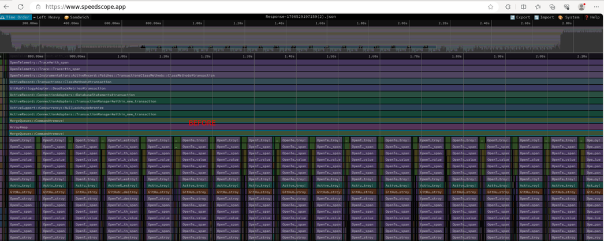
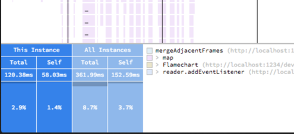
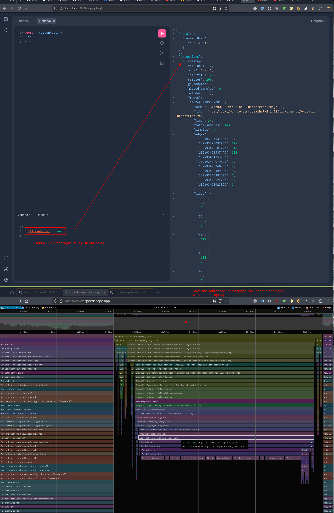

GraphQL can throw up some surprising [N+1 style performance issues](https://www.visuality.pl/posts/n-1-in-ruby-on-rails) in Ruby on Rails.

Usually this come up as "Why is this particular GraphQL query so slow?"

Here I'm going to talk through using [a Query Analyzer](https://graphql-ruby.org/queries/ast_analysis.html#using-analyzers), [StackProf](https://rubygems.org/gems/stackprof) and [Speedscope](https://www.speedscope.app/) to find out what is slowing down that query so you can fix it.

What are we hunting? Well N+1's typically look something like this 👇 on a flamegraph.



Rails is doing an `something.each { |x| x.query }` so rather than making one query to get all the data you make one query for the collection then `N` queries, one for each item in the collection.

Speedscope helps out massively here as you click on a method in that graph and see how many times it's called and what duration it's contributed
to the entire request. 

For example, here 👇 you can see `this instance` of the `mergeAjacentFrames` takes 120ms and all invocations of the method take 361ms or 8.9% of all the request time.



This means you can click around and find out which of your methods is contributing the most time to the request.

Sold on why this is useful? Ok then, let's get it setup in your Ruby GraphQL project!

## Step 1: Capture Query 👀

To fix a performance issue we first need to be able to reproduce it. 

GraphQL endpoints accept many different shapes of queries. To reproduce it you'll need to know what query was run.

For this I used the Ruby GraphQL [`query_analyzers`](https://graphql-ruby.org/queries/ast_analysis.html) which can capture the query (and more).

For example, if you have logs send to Splunk you could write an analyser to output the query like so:

```ruby
# typed: strict
# frozen_string_literal: true

class LogQueryToSplunk < GraphQL::Analysis::AST::Analyzer
  sig { void }
  def result
    query = T.cast(subject, GraphQL::Query)
    safe_query_string = query.mutation? ? "[REDACTED MUTATION]" : query.query_string
    logger.info("GraphQL Query Details",
                {
                  "user" => query.context[:current_user]&.login,
                  "query" => safe_query_string,
                })
  end
end
```

**Note:** To avoid logging sensitive information that users submit in mutations (say password change) we're going to redact those.

Now we've got the details of the slow query, let's start looking at why it's slow.

## Step 2: Find out what code is doing during that query 📏

For this we're going to use [StackProf](https://rubygems.org/gems/stackprof), as sampling profiler.

Add the gem to your project then head over to `app/controllers/graphql_controller.rb`

Find the call to `YourGraphQLSchema.execute(...)` and wrap it with `StackProf.run`, like so 👇

```ruby
    stackprof_data = StackProf.run(raw: true, aggregate: true, mode: :wall, interval: 100) do
        result = AppGraphQLSchema.execute(query, variables:, context:, operation_name:)
    end
```

**Note:** We don't always want to run the profiler, as it will slow things down, so we'll add a `using_flamegraph` option
which we can set as a variable when making the GraphQL query.

To decide if we should generate a flamegraph we'll look at params to work out if the query was passed with `flamegraph` set
and check the user is an admin (we shouldn't expose this data to normal users as it has lots of info about the apps internals).

```ruby
    # In real life this would be some `is_admin?` check, you shouldn't let normal users get the flamegraph
    # data as it exposes a lot about the internals of your app
    user_allowed_flamegraph = true

    should_generate_flamegraph = params[:flamegraph].present? || params[:variables]&.dig("flamegraph").present?

    if should_generate_flamegraph && user_allowed_flamegraph
        ...
    end
```

Lastly we need to get the data that the profiler captured so we can look at it. We'll do this in two ways.

1. When testing locally, it can be easier to grab the data from disk so let's do that too. Here we take the data and write it to a
file on disk in `./log/flamegraphs` (trying to give it a useful name).

    ```ruby
            # Write the flamegraph to disk for easy opening
            if Rails.env.development?
                sanitized_operation_name = if context[:operation_name]
                                                ActiveStorage::Filename.new(context[:operation_name]).sanitized
                                            else
                                                "dynamic-query"
                                            end
                filename = "#{Time.now.to_i}-#{sanitized_operation_name}"
                path = "#{Rails.root}/log/flamegraphs"
                file_path = "#{path}/#{filename}.flamegraph"
                FileUtils.mkdir_p(path) unless File.exist?(path)
                File.open(file_path, "a") do |file|
                    file.write(JSON.pretty_generate(stackprof_data))
                end
            end
    ```


2. When testing on remote host, use the [GraphQL Extension](https://graphql.org/learn/response/#extensions) and
append the data from the profiler to the GraphQL response alongside the reply to the GraphQL query.

    This can be done by adding to the `extensions` field on the `result`

    ```ruby
        result[:extensions] ||= {}
        result[:extensions][:flamegraph] = stackprof_data
    ```

    This means you can grab the data with curl and don't want to SSH onto the box to pull files.

Putting all this together we have all the data we need to work out what our query is doing!

```ruby
    # In real life this would be some `is_admin?` check, you shouldn't let normal users get the flamegraph
    # data as it exposes a lot about the internals of your app
    user_allowed_flamegraph = true

    should_generate_flamegraph = params[:flamegraph].present? || params[:variables]&.dig("flamegraph").present?

    if should_generate_flamegraph && user_allowed_flamegraph
        # Run the GraphQL query with the profiler
        stackprof_data = StackProf.run(raw: true, aggregate: true, mode: :wall, interval: 100) do
            result = AppGraphQLSchema.execute(query, variables:, context:, operation_name:)
        end

        result[:extensions] ||= {}
        result[:extensions][:flamegraph] = stackprof_data

        # Write the flamegraph to disk for easy opening
        if Heaven::Application.development?
            sanitized_operation_name = if context[:operation_name]
                                            ActiveStorage::Filename.new(context[:operation_name]).sanitized
                                        else
                                            "dynamic-query"
                                        end
            filename = "#{Time.now.to_i}-#{sanitized_operation_name}"
            path = "#{Rails.root}/log/flamegraphs"
            file_path = "#{path}/#{filename}.flamegraph"
            FileUtils.mkdir_p(path) unless File.exist?(path)
            File.open(file_path, "a") do |file|
                file.write(JSON.pretty_generate(stackprof_data))
            end
        end
    else
        result = AppGraphQLSchema.execute(query, variables:, context:, operation_name:)
    end
```

## Step 3: Visualizing the Data 📊

To do this we're going to use [🔬 speedscope.app](https://www.speedscope.app/) which will take our StackProf trace and render it as
a flame graph.

> What is Flamegraph?
> A Flamegraph is a visualization of hierarchical data created by Brendan Gregg, primarily used for performance profiling analysis of software applications by representing telemetry data of service latency, error causing those latencies, and pinpointing the service causing error.
> More ➡️ [https://signoz.io/blog/flamegraphs/](https://signoz.io/blog/flamegraphs/)

Let's try it out, we'll fire up GraphiQL and make a query specifying `flamegraph: true` in the variables then copy the `json` returned under
`extensions.flamegraph` save it and load in `speedscope`.



## Step 4: Profit 💵

This doesn't just work for `N+1` issues. It helps you track down most performance issues, such as a slow method.

Here is [an example](https://github.com/sqids/sqids-ruby/issues/6) of how this approach helped me identify that misusing the ruby SQID library was contributing 53% of the time to serve requests in one of our systems. 


The issue dives into the details of how the flamegraph helped me track down and resolve the issue in the SQID library!

- https://github.com/sqids/sqids-ruby/issues/6