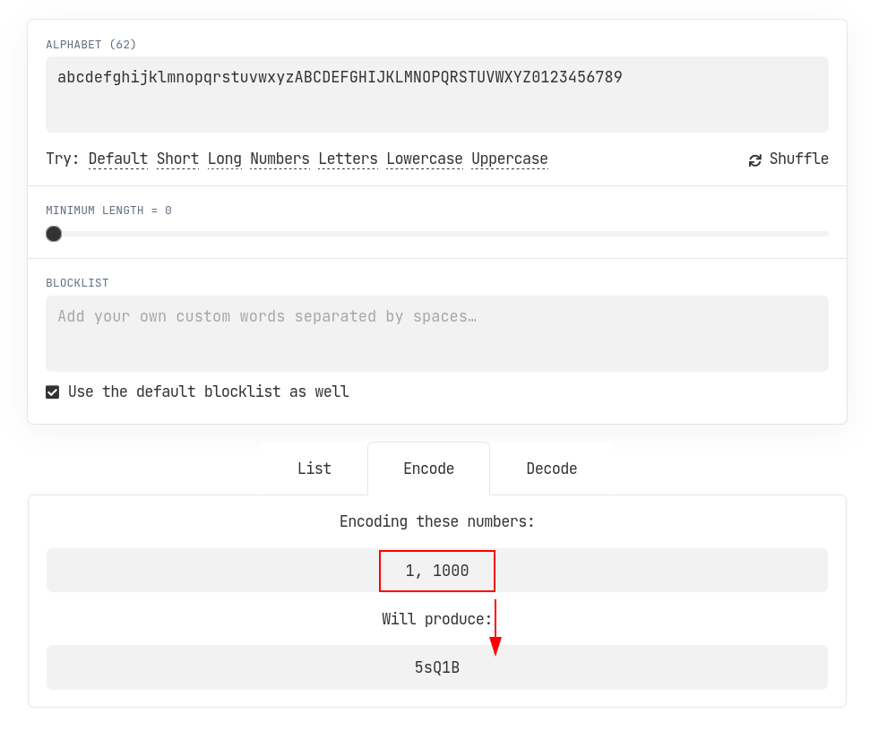

> Note, I'll use [Ruby on Rails 💎](https://rubyonrails.org/) as my example for this post but **this can be done in nearly all modern language** as SQIDs [support most of them](https://sqids.org/). They're also interoperable, so you can generate in `Ruby` and decode in another `C#` service.


## Why does GraphQL need Global IDs?

In GraphQL has the concept of [Global Object Identification](https://graphql.org/learn/global-object-identification/). Each item in the API has a unique Global ID.

If you're using a fairly normal web development framework, you'll have a Model and each instance of that will have an ID which identifies a row in a database table for that object. 

To have a GlobalID for GraphQL you need to convert combine these two bits of information, `ModelName` and `DatabaseID`, into a single ID. 

## What do most folks do?

The [graphql-ruby](https://graphql-ruby.org/schema/object_identification) package takes a simple approach here.

It uses the [`to_gid_param`](https://github.com/rails/globalid) method, this works by encoding the `Model Name` and the `DatabaseId` into a string and then base64 encoding it. 

Let's have a look at one of these, here is an example 👇

```ruby
Deployment::Pipeline::PipelineRun.first.to_gid_param
# Interim state to show content
=> "gid://heaven/Deployment::Pipeline::PipelineRun/1"
# End result
=> "Z2lkOi8vaGVhdmVuL0RlcGxveW1lbnQ6OlBpcGVsaW5lOjpQaXBlbGluZVJ1bi8x"
```

There are some problems here:

1. The base64 string **gets loooong and gets longer depending on the `Class` name**. This is problematic if you want to embed this in a URL for example.
2. Now **renaming the `Deployment::Pipeline::PipelineRun` Class will break downstream users** that store and operate on IDs.
3. You are leaking information about the internals of your application. Folks can come to rely on this by generating their of strings and base64 encoding them.


## What are SQIDs?

Ever looked at a YouTube URL 👇 and thought, "huh that's a short ID but they have billions of videos"

[https://www.youtube.com/watch?v=GFq6wH5JR2A](https://www.youtube.com/watch?v=GFq6wH5JR2A)

Well a verions of [SQIDs](https://sqids.org/) is how (or something very like them)!

> Sqids (pronounced "squids") is an open-source library that lets you generate short unique identifiers from numbers. These IDs are URL-safe, can encode several numbers, and do not contain common profanity words.

SQIDs let us take an array of `Integers`, like `[1, 1000..., 124]`, and encode that as a `String` which can be decoded again back to the array of `Integers`.



[Their playground lets you encode and decode, try it out.](https://sqids.org/playground)

## Using SQIDs for our GraphQL Global IDs

To make our Global ID for GraphQL we convert the `Model` into an `Integer`. 

To do this in ruby I defined a mapping from the `ClassName` to an `Integer`, like so:

```ruby 
class ApplicationRecord < ActiveRecord::Base
  MODEL_ID_MAPPING = T.let(
    {
      "Deployment::Pipeline::PipelineRun" => 1,
      #.... etc ....
      "Deployment::Pipeline::StageRun" => 6,
      "Deployment::Pipeline::StageRunGate" => 7,
    }.freeze,
    T::Hash[String, Integer]
  )

  sig { returns(Integer) }
  def self.global_model_id
    ApplicationRecord::MODEL_ID_MAPPING[self.name] || raise("Unexpected model: #{self.name}")
  end


  # ... other stuff ...
end
```

**Problem Solved ✅**: We can now rename a class without impacting clients. We simply point the ID to the new class name 🎉

Now we can combine the `ModelId` and the `DatabaseId` for the instance of the record and generate a SQID.

```ruby
  sig { returns(T.nilable(String)) }
  def to_global_sqid
    instance_db_id = self.id
    model_id = global_model_id
    Sqids.new.encode().encode([type_id, instance_db_id])
  end

  # Get a model instance, lets read record 1000 in the table
  # then convert it into a SQID
  Deployment::Pipeline::PipelineRun.first(id: 1000).to_global_sqid
  => "5sQ1B"
```

**Problem Solved ✅**: We have a nice short Global ID ✨`5sQ1B`✨

Now we can use can add methods to do the same in reverse, taking the SQID and getting back to an instance of the model 👇

```ruby
  sig { params(model_id: Integer).returns(T.untyped) }
  def self.model_from_model_id(model_id)
    model_class_name = ApplicationRecord::MODEL_ID_MAPPING.key(model_id)
    raise "Invalid model id in sqid: #{model_id}" unless model_class_name
    # Note this relies on eager loading
    ApplicationRecord.descendants.find { |model| model.name == model_class_name }
  end

  sig { params(global_id: String).returns(T.nilable(ApplicationRecord)) }
  def self.object_from_global_sqid(global_id)
    type_id, db_id = Sqids.new.decode(global_id)
    model_from_model_id(type_id).find(db_id)
  rescue ActiveRecord::RecordNotFound
    raise "Failed to find the instance. SQID may be invalid"
  end

  # Now lets use em! 
  ApplicationRecord.object_from_global_sqid("5sQ1B")
  # I've added the intermediate steps to explain
  => [1, 1000] 
  => 1 -> "PipelineRun"
  => 1000 -> "Row with ID 1000 in pipeline_run table"
  => <Deployment::Pipeline::PipelineRun:0x00007e724cf71b00....
```

**Problem Solved ✅**: Working back from SQID to an instance of a model!

Using Ruby GraphQL we can now wire up to `id_from_object` and `object_from_id` in the GraphQL Schema object, [following this guide](https://graphql-ruby.org/schema/object_identification).

## The result

A query like this:

```graphql
query {
  deployments(first: 5) {
    nodes {
      id
      databaseId
      state
      runResult
      partitions {
        nodes {
          id
          state
        }
      }
    }
  }
}
```

Give us 👇

```json
{
  "data": {
    "deployments": {
      "nodes": [
        {
          "id": "OjJR",
          "databaseId": 40,
          "state": "COMPLETED",
          "runResult": "RUN_STARTED",
          "partitions": {
            "nodes": [
              {
                "id": "54QA",
                "state": "RUN_SUCCEEDED"
              },
              {
                "id": "U0Le",
                "state": "RUN_SUCCEEDED"
              },
              {
                "id": "CFSW",
                "state": "RUN_SUCCEEDED"
              },
              {
                "id": "72dF",
                "state": "RUN_SUCCEEDED"
              }
            ]
          }
        },
      ]
    }
  }
```

Using `54QA` you can directly retrieve that Partition in full.

## Bonus: How do you ensure that the Model Mapping stays up to date?

Easy, create a test with iterates over all the model instances in your code and validate that they are mapped.

Here is an example in ruby.

```ruby
  it "each model type has a unique ID mapping" do
    # Load all the models
    Rails.application.eager_load!

    # Check we have all the decendants mapped for all our models
    dependants = ApplicationRecord.descendants.reject do |found_class|
      # Ignore application records used only in tests
      locations = found_class.instance_methods(false)&.filter_map { |m|
        # Getting source location off sorbet methods needs some hackery
        # See: https://github.com/sorbet/sorbet/issues/3123#issuecomment-1936205601
        sig_stuff = T::Utils.signature_for_instance_method(found_class, m)
        next if sig_stuff.nil? # Some methods won't be wrapped by sorbet
        method_stuff = sig_stuff.method
        method_stuff.source_location.first
      }
      locations&.any? { |l| l.include?("/spec/") }
    end

    expect(dependants.map(&:name)).to match_array(ApplicationRecord::MODEL_ID_MAPPING.keys)

    # Check that we can get a unique ID for each model
    results = dependants.filter_map do |model|
      # This will error if the model does not have an id defined in
      # MODEL_ID_MAPPING in `application_record.rb`
      # You need to go add it there and assign it an unique integer id
      model.global_model_id
    end

    # Assert that all results are unique
    expect(results.uniq).to eq(results)
  end
```