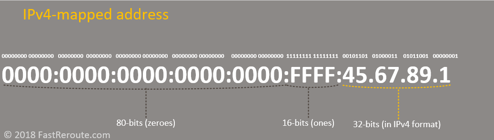

This adventures starts with a simple eBPF program to transparently redirect DNS requests on port 53 for a single program (or docker container).

To do this I used [`BPF_CGROUP_INET4_CONNECT`](https://docs.ebpf.io/linux/program-type/BPF_PROG_TYPE_CGROUP_SOCK_ADDR/#bpf_cgroup_inet4_connect-and-bpf_cgroup_inet6_connect) on a `cgroup`. That lets me inspect and redirect traffic when [`syscall.connect`](https://www.man7.org/linux/man-pages/man2/connect.2.html) occurs from within the `cgroup`. Here is a simplified version 👇

```c
int handle_connect_redirect(struct bpf_sock_addr *ctx, __be32 original_ip,
                            bool is_connect4, struct redirect_result *result) {
  __be32 new_ip = original_ip;
  __be16 new_port = ctx->user_port;

  if (ctx->user_port == bpf_htons(53)) {
    new_ip = const_mitm_proxy_address; // Our MITM DNS server we're using for intercept
    new_port = bpf_htons(const_dns_proxy_port);
  }

  result->is_redirected = did_redirect;
  result->ip = new_ip;
  result->port = new_port;
  return 1;
}

SEC("cgroup/connect4")
int connect4(struct bpf_sock_addr *ctx) {
  struct redirect_result r = {
      .ip = ctx->user_ip4,
      .port = ctx->user_port,
      .is_redirected = false,
  };
  handle_connect_redirect(ctx, ctx->user_ip4, true, &r);
  if (r.is_redirected) {
    // If we redirected the request then we need to update the socket
    // destination to the new IP and port
    ctx->user_ip4 = r.ip;
    ctx->user_port = r.port;
  }
  return 1;
}
```

The machines running the program don't have IPv6 support, so my assumption was that I'd covered the bases.

I then used an [`BPF_PROG_TYPE_CGROUP_SKB` eBPF program](https://docs.ebpf.io/linux/program-type/BPF_PROG_TYPE_CGROUP_SKB/) to ensure that the redirect couldn't be circumvented by making direct IP calls. Roughly this looked like 👇

```c
SEC("cgroup_skb/egress")
int cgroup_skb_egress(struct __sk_buff *skb) {
  // Block IPv6 traffic. Currently not supported.
  if (skb->family == AF_INET6) {
    struct event info = {
        ...
        .eventType = PACKET_IPV6_TYPE,
    };

    bpf_ringbuf_output(&events, &info, sizeof(info), 0);

    return EGRESS_DENY_PACKET;
  }

  // .... then we'd check if outbound ip was allowed and deny/allow ...
```

> Note: I'm using [`bpf_ringbuf_output`](https://docs.ebpf.io/linux/helper-function/bpf_ringbuf_output/) here to track events from the eBPF program and logging them from userspace. This was invaluable for tracking down this bug, without them, it would be very hard to reason about what was happening inside the eBPF portion of the progam.

Everything was going very well, **until a user tried `dotnet` CLI.**

When they ran `dotnet add package x` it would hang indefinitely and produce lots of `PACKET_IPV6_TYPE` blocked messages via the `ringbuf_output`.

## Oh dotnet is using IPv6

The obvious conclusion was the machine was somehow making IPv6 requests, so I did some digging

- ❓ My `connect4` eBPF program was not getting hit, I added similar `bpf_ringbuf_output` events so I could stream to log in userspace
- ❌ Hooking up wireshark, I confirmed that `dotnet` wasn't making IPv6 calls off the box and the box couldn't make IPv6 requests to the internet

**Now I'm baffled.**

- Network traffic shows IPv4 calls going out
- `egress` eBPF program shows IPv6
- `connect4` eBPF program doesn't fire suggesting no IPv4 `connect` call is made

What! These contradict each other!

## Read more Kernel and `dotnet` source code

At this point I knew there must be something I was misunderstanding.

I spent a bunch of timing digging into the kernel, eBPF and `dotnet` to see if I could find anything that made the `dotnet cli` special, as no other tooling seemed to be impacted.

I started changing the program to get more info, I added a `connect6` eBPF program and hook that this would hit for `syscall.connect` on IPv6. Hopefully it would confirm thas `dotnet` was infact using IPv6 somehow?!

```c
SEC("cgroup/connect6")
int connect6(struct bpf_sock_addr *ctx) {
  struct event info = {
      .eventType = IPV4_VIA_IPV6_REDIRECT_TYPE,
  };
  bpf_ringbuf_output(&events, &info, sizeof(info), 0);
  return 1;
}
```

Running the repro steps `dotnet add package x` with the above hook, I was immediately greeted by `connect6` being hit, even though wireshark showed IPv4 traffic exiting the VM.

At this point the only conclusion I could think of was that the kernel is seeing IPv6 but the traffic is actually IPv4.

This triggered a memory about dual stack networking. Digging through `dotnet` repos I found this:

> Since .NET 5, we are using DualMode sockets in SocketsHttpHandler. This allows us to handle IPv4 traffic from an IPv6 socket, and is considered to be a favorable practice by RFC 1933
> [link](https://devblogs.microsoft.com/dotnet/dotnet-6-networking-improvements/#an-option-to-globally-disable-ipv6)
> [rfc1933](https://datatracker.ietf.org/doc/html/rfc1933)

The feature had a kill switch! I gave it a try, with `DualMode sockets` disabled everything worked as expected, `connect4` got hit and the `egress` didn't see the request as being IPv6. 🚀

How the question was why? What was this feature doing under the covers.

## `IPv4-Compatible IPv6 Address` or "When IPv4 pretends to be IPv6 for a little bit"

This 👇 line of the `dotnet` `DualMode` socket docs felt like the key 🗝

> This allows us to handle IPv4 traffic from an IPv6 socket

But how! Digging more into the source and kernel I found:

- [`IPv4-mapped IPv6 addresses`](https://en.m.wikipedia.org/wiki/IPv6#IPv4-mapped_IPv6_addresses)

This is a way to encode an IPv4 address **inside an IPv6 address**.



**When used you get an IPv6 address where the last 32bits are actually a IPv4 address**.

I updated my `connect6` eBPF to output the IPv6 address to me `bpf_ringbuf_output` event, so I could have a look at it.

Low and behold it was a `IPv4 mapped address` 🤯🎉

**When using `DualMode sockets` `dotnet` requests an IPv6 Socket, **even for non-IPv6 requests**, and sets the `user_ip6` address field to be a [IPv4-Mapped](https://en.m.wikipedia.org/wiki/IPv6#IPv4-mapped_IPv6_addresses) address.**

> What does a IPv4 mapped address look like? These look like `::ffff:1.1.1.1` encoding the IPv4 address at the end of the IPv6 address.

I thought I must have this wrong, surely you can't just smash an ipv4 address in ipv6 field and magic happens?! Nope, didn't have it wrong, that's what happens. Linux supports this, and will go on to route the request as IPv4.

My wireshark traces didn't see the IPv6 traffic, as the kernel is translating it back to IPv4 when making the networking call, so this interim state is only visible to the `eBPF` programs/kernel.

## Fixing the eBPF to handle `IPv4-mapped IPv6 addresses`

To make my original `syscall.connect` intercept work I have to now hook both IPv4 and IPv6 version of it. For this case I updated the `connect6` from earlier to parse out the IPv4 address from the IPv6 address.

```c
SEC("cgroup/connect6")
int connect6(struct bpf_sock_addr *ctx) {
  // Check if we have an IPv4-mapped IPv6 address (::ffff:x.x.x.x)
  // The first 10 bytes should be zeros, followed by 2 bytes of 0xffff
  // user_ip6[0] and user_ip6[1] should be 0 (first 64 bits)
  // user_ip6[2] should be 0x0000ffff (next 32 bits with pattern 0000...1111)
  if (ctx->user_ip6[0] != 0 || ctx->user_ip6[1] != 0 ||
      ctx->user_ip6[2] != bpf_htonl(0x0000ffff)) {
    return 1;
  }

  // See: https://en.m.wikipedia.org/wiki/IPv6#IPv4-mapped_IPv6_addresses As
  // bpf_sock_addr stores `user_ip6` as IPv6 is 4x32 bits to get the IPv4
  // address we ignore the first 96 bits and take the last 32 bits which is the
  // __u32 at index 3 of the user_ip6 array
  __be32 ipv4_address = ctx->user_ip6[3];

  struct event info = {
      .ip = bpf_ntohl(ipv4_address),
      .eventType = IPV4_VIA_IPV6_REDIRECT_TYPE,
  };
  bpf_ringbuf_output(&events, &info, sizeof(info), 0);

  struct redirect_result r = {
      .ip = ipv4_address,
      .port = ctx->user_port,
      .is_redirected = false,
  };
  handle_connect_redirect(ctx, ipv4_address, false, &r);
  if (r.is_redirected) {
    // If we redirected the request then we need to update the socket
    // destination to the new IP and port
    ctx->user_ip6[3] = r.ip;
    ctx->user_port = r.port;
  }
  return 1;
}
```

It pulls the original IPv4 address out and then calls the existing `handle_connect_redirect` method. Done right? Nope.

This wasn't quite enough though as my `egress` eBPF program would still block these requests as IPv6.

I tracked this down to this check in the `egress` program:

```c
if (skb->family == AF_INET6) {
    // end up here
    return 0
}
```

The mapped IPv4 socket was identifying its family as IPv6, how do I work around this? I want to block IPv6 but not IPv4 mapped via IPv6 sockets 🤔

After lots of playing I found this approach:

```c
if (skb->protocol == bpf_htons(ETH_P_IPV6)) {
    // IPv6 hits this but IPv4 Mapped doesn't
    return 0
}
```

By looking at the protocol on `skb` I was able to distinguish between IPv6 and IPv4 mapped onto IPv6 (TODO: more testing needed on this last bit).

## That's it

**When is IPv4 not IPv4?**

When it's using an `IPv4-Compatible IPv6 Address` to sending IPv4 over an IPv6 socket 🤯