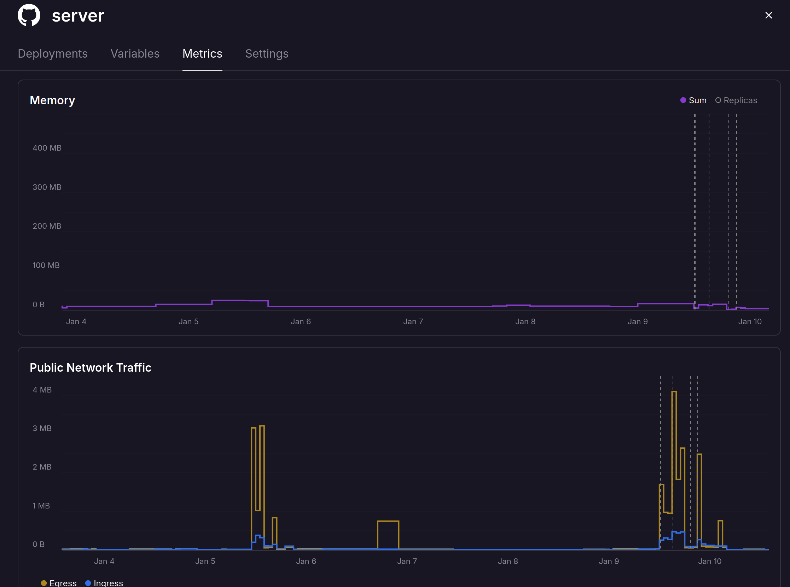

**Spoiler:** I made a free and open-source way to get an interactive web terminal to your GitHub Action when it fails. Try it out here: https://actions-term.gripdev.xyz/

## Building it

I think we've all been there, **your build fails in Actions, but the script works fine locally.** You now settle into a slow loop of:

1. Push speculative change
2. See if it worked

It was in the middle of one of these when I started thinking about how to make it better. 

A Terminal would be great, that's obvious, but how to make it happen? How could I make it a free, open to anyone, without costing me lots of money?

Operating a service that forward traffic between a customer and the Actions VM would cost money. 

What about a Peer-to-Peer connection? I'd recently been reading about how [Tailscale](https://tailscale.com/blog/how-tailscale-works), [iroh](https://github.com/n0-computer/iroh) and [WebRTC](https://webrtc.org/) use [UDP Hole Punching to create Peer-to-Peer (P2P) connections](https://tailscale.com/blog/how-nat-traversal-works) between nodes without relaying traffic. 

Could I use P2P and funnel a terminal session over it? Well the Actions VM is on the internet and allows UDP outbound, so it should work!

A simple bit of scripting proved it did 🥳 With WebRTC, if the two nodes exchange information about their connectivity ([ICE Candidates](https://webrtc.org/getting-started/peer-connections#ice_candidates)) then I could form a connection.

## Security and Identities

The next problem is, **how do you prove each end of the P2P connection is who they say they are?**

It's important. I want to ensure that `lawrencegripper` can only access terminals for Actions triggered by `lawrencegripper`. 

The browser side is relatively easy, we can use OAuth to login via GitHub and get a verified username ✅

On the Actions VM [we have OIDC](https://docs.github.com/en/actions/concepts/security/openid-connect), commonly used to auth from Actions to cloud providers. 

Anyone can use it though, it gives us the ability to issue a signed OIDC token from within our Action which proves:

1. The repo it's running on
2. The user account that triggered it
3. The audience it is intended for

To enable this feature you set the following permissions in the workflow

```yaml
    permissions:
      id-token: write
```

You request a token via a REST request in the action, for example:

```typescript
    const requestURL = process.env.ACTIONS_ID_TOKEN_REQUEST_URL;
    const requestToken = process.env.ACTIONS_ID_TOKEN_REQUEST_TOKEN;
    const SERVER_URL = 'https://actions-term.gripdev.xyz';
    const url = new URL(requestURL);
    url.searchParams.set('audience', SERVER_URL);

    const resp = await fetch(url.toString(), {
        headers: {
        Authorization: `Bearer ${requestToken}`,
        Accept: 'application/json',
        },
    });
```

> [Complete code](https://github.com/lawrencegripper/actions-term-on-fail/blob/21c8350bc33a4bf4451473eabecc9d7b2eedc716/client/src/index.ts#L35-L70)

Then, when the Action calls the server, it can include this token. The server then validates cryptographically via JWKS:

```golang
    const githubOIDCIssuer = "https://token.actions.githubusercontent.com"
    const githubJWKSURL = "https://token.actions.githubusercontent.com/.well-known/jwks"
    // Fetch JWKS
	keySet, err := jwkCache.Get(ctx, githubJWKSURL)
	if err != nil {
		return "", "", "", fmt.Errorf("failed to fetch JWKS: %w", err)
	}

	// Parse and validate token with clock skew tolerance
	parseOpts := []jwtx.ParseOption{
		jwtx.WithKeySet(keySet),
		jwtx.WithIssuer(githubOIDCIssuer),
		jwtx.WithValidate(true),
		jwtx.WithAcceptableSkew(2 * time.Minute),
		jwtx.WithAudience(oidcExpectedAudience),
	}
	token, err := jwtx.Parse([]byte(tokenStr), parseOpts...)
	if err != nil {
		return "", "", "", fmt.Errorf("token validation failed: %w", err)
	}
```

> [Complete code](https://github.com/lawrencegripper/actions-term-on-fail/blob/main/server/main.go#L173-L221)

## Connecting the Peers (ie. [Signaling Server](https://developer.mozilla.org/en-US/docs/Web/API/WebRTC_API/Connectivity#signaling)) 

At this point we know:
1. We can create a connection between two peers (Actions VM <-> Users Browser) with WebRTC
2. We have a way to validate the identity of both ends of the connection (OAuth and OIDC)

What's left is the server to introduce the two peers 🤝. Let's build a server to do that.

The server doesn't need to handle the terminal data, that goes between the two peers, it's only doing introductions. 
When the VM and Browser are connected it sends each one the connection details for the other.

To do this the browser and the VM both create [Server-sent events (SSE)](https://developer.mozilla.org/en-US/docs/Web/API/Server-sent_events/Using_server-sent_events) connections to the signaling server, providing their OAuth credentials or OIDC to prove their identity.

The server then stores:

```golang
	runIdToSessions            = make(map[string]*Session) // runId -> session
	runIdToSessionsMu          sync.RWMutex
	runIdRunnerSseClient       = make(map[string]*SSEClient) // runId -> SSE client (Actions VM)
	runIdRunnerSseClientsMu    sync.RWMutex
	actorToBrowserSseClients   = make(map[string][]*SSEClient) // actor -> list of browser SSE clients
	actorToBrowserSseClientsMu sync.RWMutex
```

Both the Actions VM and the browser connect to the server. Giving it their connectivity information. 

The server then, via SSE, sends the Actions VM connectivity details to the browser and the Browser's connectivity details to the Actions VM. 

At this point they establish the Peer-to-Peer connection 🥳

For bonus points, when a new Actions VM connects I can see if a browser is open waiting and send them a notification. 

```golang
    runIdRunnerSseClientsMu.Lock()
	runIdRunnerSseClient[runId] = client
	log.Printf("SSE: Runner connected for actor %s (total clients: %d)", actor, len(runIdRunnerSseClient))
	runIdRunnerSseClientsMu.Unlock()

	// Notify browser subscribers about new session
	sess, ok := runIdToSessions[runId]
	if ok {
		notifyNewSession(sess)
	}
```

> [Full Code](https://github.com/lawrencegripper/actions-term-on-fail/blob/255c79feee7d2cbb854144409a93bdd3a03fcdb4/server/main.go#L262-L271)

## Displaying the Terminal

Ok, we're close now. We have the signaling server to exchange details and then the peers have a p2p connection. 

What about creating a terminal and streaming the data?

WebRTC has a `datachannel` which you push arbitrary data through. 

On the Actions VM side we create a `pty.Shell` and stream that data over our `datachannel (dc)`

```javascript
    shell = pty.spawn(SHELL, [], {
        name: 'xterm-256color',
        cwd: process.env.GITHUB_WORKSPACE || process.cwd(),
        env: process.env as Record<string, string>,
    });

    shell.onData((shellData) => {
        dc.sendMessage(shellData);
    });
```

In the browser we then need to display an interactive terminal. 

Reading around the awesome Ghostty library has an XTerm.js compatible implementation, I hooked this up and it worked first time 🥰

Well it did and it didn't, the Terminal we spawned via PTY doesn't have any idea how big our terminal in the browser (Lines and Columns) so we get some horrible rendering in the terminal. 

With a bit of poking, googling and some Opus 4.5, I created some code which estimates the size of terminal, via font sizing, and converts this to a rough column / rows. Then, on establishing the P2P connection I can send a `setup` JSON message which the Actions VM uses to start `pty.spawn` with the right sizing for the terminal.

## We're done, right?

Not quite, at this point we have 👇

```
┌─────────────────┐                              ┌─────────────────┐
│  GitHub Runner  │◄────────────────────────────►│    Browser      │
│  (TypeScript)   │      Direct P2P (WebRTC)     │  (ghostty-web)  │
│                 │                              │                 │
└────────┬────────┘                              └────────┬────────┘
         │                                                │
         │ Register session                               │ Get sessions
         │ (OIDC Token Auth)                              │ (GitHub OAuth)
         ▼                                                ▼
         └──────────────►┌─────────────────┐◄─────────────┘
                         │     Server      │
                         │   (Go - Auth    │
                         │   & Discovery)  │
                         └─────────────────┘

```

There is a lot of trust placed in the signaling server. It has to do the right thing, or it could provide access to someone else's Actions VM. 

Let's do better.

## Trust vs Zero-Trust

I've mentioned already **the signaling server should only connect up users with actions they've started**. 

That relies on explicit trust, from users, that I'm going to do the right thing.

What if I've got a bug? What if someone compromises the signaling server? What if they steal the domain and run their own server on it? 

Well, then they could hook up peers that shouldn't be connected and ... do mean things.

That sounds bad, lets work out how to fix that.

What if the `user` provided the Actions VM with a secret, that only they know?

When the P2P connection is made, the Actions VM could refuse to talk to the browser until it provides the right secret.

Secrets are cool and everything but if they're intercepted they're reusable, could we use a One-Time-Password (OTP) commonly used for 2FA on sites? Sure thing! Even better tools like 1Password will autofill it for you.

What does this flow look like? Roughly it's 👇

```
┌─────────────────┐                              ┌─────────────────┐
│  GitHub Runner  │◄────────────────────────────►│    Browser      │
│  (TypeScript)   │      Direct P2P (WebRTC)     │  (ghostty-web)  │
└────────┬────────┘                              └────────┬────────┘
     │                                                │
     │◄──────── 1. WebRTC Connection Established ────►│
     │                                                │
     │◄───────────── 2. Browser sends OTP ────────-───│
     │                                                │
     ├ 3. Runner validates OTP against secret         ┤
     │                                                │
     │         ┌──────────────────────┐               │
     │         │  If OTP Valid:       │               │
     │-────────│  4. Terminal access  │──────────────►│
               │     granted          │               
               └──────────────────────┘               
```

Even if the signaling server is manipulated, to hook up two peers which shouldn't be connected, the user won't be able to execute commands unless they can provide a valid OTP. 

Better still the Signaling server (which I run) is never sent either the OTP or the OTP Secret used to validate each OTP. 

This validation happens between two peers you own (Actions VM and your Browser).

## So now we're done? 

One last thing... make the signaling server cheap to host.

I want to offer this for free for anyone to use. It's a simple `go` binary in a docker image to make it easy to self-hosting and test locally. 

A while ago I'd started poking at [`railway.com`](https://railway.com/), it's cloud with a big billing twist, **you only pay for the CPU and Memory you actually use**.

Let's take an example:

- In Azure/AWS I have to say "I want 2 CPUs and 8GB" and I pay for that regardless of what I use.
- On `railway.com` I say "Use **up to** x CPUs and y GB" then you only pay for what the service actually consumes.

> Note: In either Azure/AWS or Railway you still pay network egress.

How does this work out for the signaling server?

**Amazingly well**: it's peak memory usage so far is 20MB!



Even then it feels a bit wasteful running it all the time. There will be chunks of time when folks aren't using it.

This was where I found a platform feature called [sleeping](https://docs.railway.com/reference/app-sleeping), it's serverless but without the pain of moving away from the docker model to some proprietary runtime. 

When the service isn't doing anything, Railway spin down the service. If someone turns up, they hold the connection for a moment while restoring the container, then send the request through.

What does a cold start look like on our simple signalling server? It's hardly recognizable! Here is a recording of it happening:

